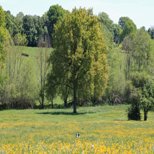
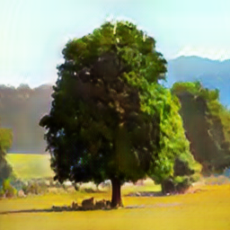

# Ganilla

**Paper:** https://arxiv.org/abs/2002.05638

**Network** https://github.com/giddyyupp/ganilla

## Content

This repo contain my own model train with ganilla. The goal is to test the ganilla network on custom datasets to transform a [landscape](https://www.kaggle.com/arnaud58/landscape-pictures) pictures into [*the witness game*](https://www.kaggle.com/arnaud58/the-witness) style. The two datasets are on kaggle and are create by myself.

To use the model in the folder *landscape2witness* you must to download [the PyTorch github repo](https://github.com/giddyyupp/ganilla) and execute the command : 

``python test.py --dataroot ./datasets/landscape2witness --name landscape2witness --model cycle_gan --netG resnet_fpn --batch_size 4 --epoch 100``

Here exemple of results pictures :

## Landscape to witness

Landscape photo | Witness style
 --- | --- 
_real_A.png) | _fake_B.png) 
_real_A.png) | _fake_B.png) 
 |  
_real_A.png) | _fake_B.png) 
_real_A.png) | _fake_B.png) 
 |  
## Witness to landscape

Witness Game picture | "Realist" style
 --- | --- 
_real_B.png) | _fake_A.png) 
 |  
 |  
 |  
 |  
 |  
